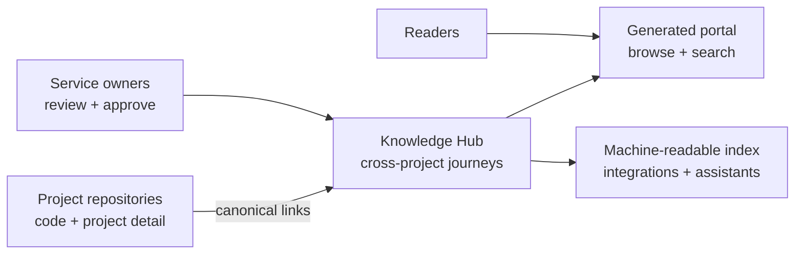

# Cross-project knowledge architecture

## Decision

Use a federated docs-as-code model:

1. Each delivery project remains the source of truth for its internal technical
   documentation.
2. This repository owns cross-project journeys, shared operating procedures,
   discovery, and navigation.
3. Markdown with structured YAML front matter is the portable content source.
4. A build step validates metadata and creates a static, searchable portal.
5. Stable page IDs and URLs allow other projects to link here safely.

## Why this shape

Centralizing every document creates stale copies and unclear ownership.
Keeping everything in separate project repositories makes cross-project tasks
hard to discover. The federated model splits responsibility at a clear seam:
projects own facts about themselves; the hub owns the path across them.

## Content model

| Type | Reader question | Expected shape |
|---|---|---|
| Project | “What is this system?” | Purpose, ownership, dependencies, links |
| How-to | “How do I complete one task?” | Preconditions, ordered steps, verification |
| Guide | “Help me choose and complete a path” | Decision points, branches, outcomes |
| FAQ | “What is the short answer?” | Concise answer with canonical links |
| Reference | “What are the exact rules or values?” | Structured facts, tables, definitions |

Every page has:

- a stable `id`;
- a human title and summary;
- one `type`;
- one accountable `owner`;
- lifecycle `status`;
- `projects` and `audience` facets;
- `tags` for secondary discovery;
- `updated` and `review_by` dates;
- optional `related` page IDs.

The validator enforces these fields and verifies IDs, dates, links, and allowed
values. The generator emits both HTML and `knowledge-index.json`.

## Information architecture

The primary navigation follows reader intent rather than the organization chart:

- **Projects** — orient to a system and find its owner.
- **How-tos** — execute a focused, repeatable task.
- **Guided paths** — make choices across multiple systems.
- **FAQs** — get a short answer and a route to more detail.
- **Reference** — consult exact shared facts and standards.

Project, audience, and tag facets cut across those sections. Search indexes
titles, summaries, headings, and body text.

## Ownership boundary

Use this decision:

1. Is the material generated from code or specific to one implementation?
   Keep it in that project and link to it.
2. Does the task move through multiple projects, or is it a shared policy?
   Put it here.
3. Is a shared concept defined by one project? Keep the definition with the
   owner; publish a short hub page that points to it.

Never paste a project's runbook into this repository. Link to the canonical
runbook and document only the cross-project entry, handoff, and exit criteria.

## Governance

- **Contributor:** authors or updates a page.
- **Content owner:** accountable for correctness and review dates.
- **Project owner:** approves statements about their project.
- **Maintainer:** evolves taxonomy, templates, validation, and portal behavior.

Recommended review intervals:

| Risk | Examples | Review interval |
|---|---|---|
| High | production access, incidents, security | 90 days |
| Medium | onboarding, release coordination | 180 days |
| Low | concepts, project orientation | 365 days |

Pull requests should fail on invalid metadata, broken internal relationships, or
duplicate IDs. Stale review dates should be visible and managed as work rather
than silently hiding content.

## URL and change policy

- URLs are derived from file paths and should be treated as permanent.
- Rename or move a published file only with a redirect (a future generator
  extension); otherwise leave a small archived page at the old path.
- Change a page `id` only when the subject changes meaning.
- Archive instead of delete when external links may exist.

## Integration path

The first version deliberately has no runtime service or database. Static files
are inexpensive to host, cache, and secure. Later integrations should consume
`knowledge-index.json` rather than scrape HTML. Possible additions include:

- repository dispatches that ingest project catalogs;
- authentication at the hosting layer;
- search analytics with privacy controls;
- an assistant retrieval index built from the JSON output; and
- ownership synchronization from `CODEOWNERS` or a service catalog.

Those additions do not require migrating the authoring format.
